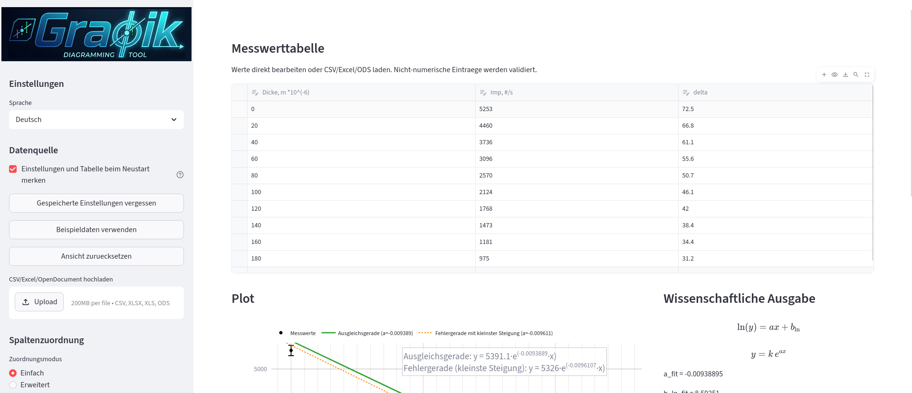

<p align="center">
  
</p>

# Graphik
###### By Mihai Cazac
Graphik is a local Streamlit app for creating clean scientific plots from tabular data.
It is designed for workflows with measurement tables, error bars, fit lines, subjective error lines, slope triangles, descriptive statistics, and export-ready figures.

## Features

- Upload measurement tables from CSV, Excel, or OpenDocument (`.ods`)
- Edit data directly in the browser with a table UI
- Map any columns to `x`, `y`, and vertical uncertainty
- Plot measurement points with visible vertical error bars
- Auto grid, milimetric grid, exponential grid 
- Add a best-fit line 
- Add error lines for linear and exponential workflows
- Display the fit and error line functions and the  coefficient of determination 
- Statistic Mode
- Draw slope triangles with automatic `Δx` / `Δy` labels
- Use math-style notation in labels such as `\Delta m`, `T_i`, `T^2`, `\sigma_T`
- Export figures as PNG, SVG, and PDF
- much more, try it out

## Dashboard




## Standard Install (recommended)

### Requirements
- Python 3.11 or newer
- `git` installed if you want to clone the repository


### Get the repository

You can either download the repository as a ZIP from GitHub:

- <https://github.com/sharpclone/Graphik/archive/refs/heads/main.zip>

Or clone it with Git:

```bash
git clone https://github.com/sharpclone/Graphik.git
cd Graphik
```

If you downloaded the ZIP instead, extract it and enter the project folder:

```bash
cd Graphik
```

### Install dependencies

```bash
python3 -m venv .venv
source .venv/bin/activate
pip install -r requirements.txt
```
### Run the app

```bash
python3 -m venv .venv
source .venv/bin/activate
streamlit run app.py
```

## Windows Portable Build

For Windows users, there is also a portable build provided here as a zip. You just download and unarchive it.
It includes:

- `Graphik.exe`
- `_include/`

Both must stay in the same folder. The executable will not work correctly if `_include` is moved, renamed, or deleted.

Build output: `dist_portable/Graphik/`
Default local URL: `http://127.0.0.1:8501/`
If Graphik is already running, launching the executable again will reopen the existing local app instead of starting a second instance.

